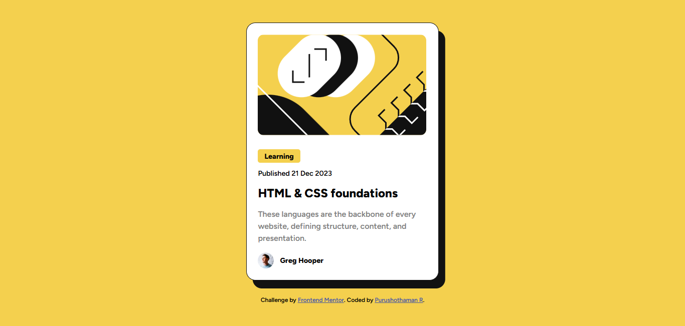

# Frontend Mentor - Blog preview card solution

This is a solution to the [Blog preview card challenge on Frontend Mentor](https://www.frontendmentor.io/challenges/blog-preview-card-ckPaj01IcS). Frontend Mentor challenges help you improve your coding skills by building realistic projects.

## Table of contents

- [Overview](#overview)
- [The challenge](#the-challenge)
- [Screenshot](#screenshot)
- [Links](#links)
- [My process](#my-process)
- [Built with](#built-with)
- [What I learned](#what-i-learned)
- [Continued development](#continued-development)
- [Useful resources](#useful-resources)
- [Author](#author)
- [Acknowledgments](#acknowledgments)

**Note: Delete this note and update the table of contents based on what sections you keep.**

## Overview

### The challenge

Users should be able to:

- See hover and focus states for all interactive elements on the page.

### Screenshot

### Links

- Live Site URL: [Add live site URL here](https://your-live-site-url.com)

## My process

### Built with

- Semantic HTML5 markup
- CSS custom properties
- Flexbox
- Mobile-first workflow
- [Figtree](https://fonts.google.com/specimen/Figtree) (Font Family)
- CSS Grid

### What I learned

In this project, I learned how to:

- Effectively use CSS custom properties for color and layout consistency.
- Implement Flexbox and CSS Grid for a responsive and adaptable layout.
- Design with a mobile-first approach, ensuring responsiveness from small to large screen sizes.
- Enhance the user experience by adding interactive hover and focus states to clickable elements.

### Continued development

In future projects, I aim to focus on:

- **JavaScript integration**: Adding interactivity such as dynamic content, animations, or even creating a blog-like functionality (e.g., a comment section or like/dislike buttons) will help enhance my skills.
- **Accessibility**: Ensuring that the page is fully accessible, including testing with screen readers and making the design keyboard-navigable, to meet WCAG (Web Content Accessibility Guidelines) standards.
- **Performance optimization**: Learning techniques for reducing page load times, such as optimizing images and using lazy loading for resources, is an area I want to explore further.
- **Advanced CSS features**: I want to dive deeper into CSS Grid, CSS Variables, and CSS animations to add more complex layouts and fluid design systems in future projects.

### Useful resources

- [CSS Tricks Flexbox Guide](https://css-tricks.com/snippets/css/a-guide-to-flexbox/) - This guide was incredibly helpful in understanding how to create layouts using Flexbox. It made it much easier to center elements and control their alignment.
- [MDN Web Docs: CSS Grid](https://developer.mozilla.org/en-US/docs/Web/CSS/CSS_Grid_Layout) - I used this resource to understand how to implement CSS Grid for better layout control. It helped me create a clean, organized, and responsive design.
- [Google Fonts: Figtree](https://fonts.google.com/specimen/Figtree) - This font was a great choice for the design, and Google Fonts made it super easy to integrate with just a single line of code.
- [Frontend Mentor's Design Resources](https://www.frontendmentor.io/resources) - The resources provided by Frontend Mentor helped guide my approach to making the project more professional and polished.

### Author

- GitHub Profile - [FrontEndExplorer-Temp](https://github.com/FrontEndExplorer-Temp)
- Frontend Mentor - [@FrontEndExplorer-Temp](https://www.frontendmentor.io/profile/FrontEndExplorer-Temp)

Feel free to follow me on GitHub and Frontend Mentor for more projects. You can also check out my Twitter for design and coding tips!

### Acknowledgments

I would like to acknowledge:

- **Frontend Mentor** for providing the challenge and supporting my learning process with their detailed and clear requirements.
- **The open-source community** for providing fantastic tutorials, guides, and resources that helped me enhance my understanding of CSS Flexbox, Grid, and layout techniques.
- **My peers and mentors** for their feedback, suggestions, and encouragement throughout the course of the project.

Thanks to everyone who contributed indirectly to my learning—I'm excited to apply these new skills to my next challenge!
